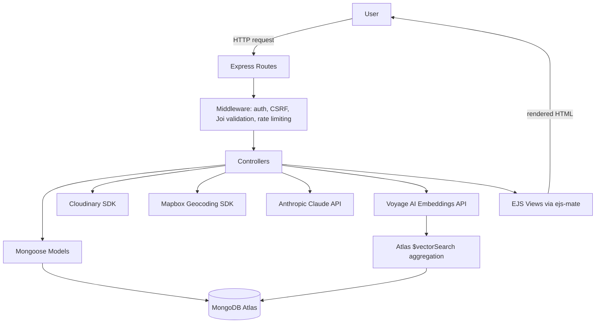
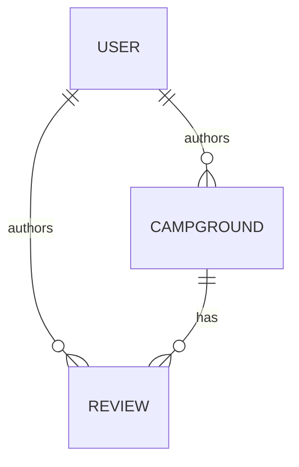

# YelpCamp

A full-stack campground discovery and review platform with an MVC Express/MongoDB backend, extended with AI-assisted review intelligence and semantic (embedding-based) search on top of MongoDB Atlas Vector Search.

## Overview

YelpCamp is a server-rendered (EJS) marketplace application where authenticated users can list campgrounds, upload photos, leave reviews, and search for campgrounds. It started from the classic YelpCamp MVC tutorial project and has been substantially reworked: the dependency stack was upgraded across several major versions (Mongoose 5→8, Cloudinary SDK 1→2, etc.), a CSRF/rate-limiting/env-validation security pass was applied, and three AI-backed features were added on top — review summarization, per-review sentiment tagging, and natural-language semantic search powered by vector embeddings.

Every feature described below was verified directly against the current source — see [Engineering Highlights](#engineering-highlights) and the routes table for exact file references.

## Key Features

| Feature | Status |
|---|---|
| User authentication (register/login/logout) via Passport | Implemented |
| Campground CRUD with author-only edit/delete | Implemented |
| Reviews (create/delete) with author-only delete | Implemented |
| Image upload to Cloudinary (multi-file, in-memory buffering) | Implemented |
| Geocoding (address → coordinates) via Mapbox | Implemented, requires `MAPBOX_TOKEN` |
| Pagination on the campground listing page | Implemented |
| CSRF protection (synchronizer token pattern) | Implemented |
| Rate limiting on login/register | Implemented |
| MongoDB input sanitization (`express-mongo-sanitize`) | Implemented |
| AI review summarization | Implemented, requires `ANTHROPIC_API_KEY` |
| Per-review sentiment tagging | Implemented, requires `ANTHROPIC_API_KEY` |
| Aspect-based review breakdown (cleanliness/location/host quality/wifi/value) | Implemented, requires `ANTHROPIC_API_KEY` |
| Semantic natural-language search | Implemented, requires `VOYAGE_API_KEY` + an Atlas Vector Search index |

## AI/ML Capabilities

This project uses two distinct kinds of "AI" and the distinction matters for how each is discussed in an interview:

- **LLM API calls** (Anthropic Claude) — used for review summarization, sentiment classification, aspect-based breakdown, and search-query parsing. These are prompted text-generation calls, not trained models owned by this project.
- **Embeddings + vector search** (Voyage AI + MongoDB Atlas) — genuine dense-vector retrieval. A campground's text is converted to a 1024-dimension embedding at write time; a search query is converted to a vector at query time; MongoDB's `$vectorSearch` aggregation stage finds nearest neighbors by cosine similarity.

Both categories degrade gracefully: if their respective API key is absent, the feature silently no-ops (returns `null`/skips) rather than crashing the request. This is enforced in `utils/aiInsights.js` and `utils/embeddings.js` via an early return when the relevant env var is missing.

### Review Summarization & Sentiment

- **Provider/model:** Anthropic Claude — `claude-sonnet-5` for summarization and aspect analysis, `claude-haiku-4-5-20251001` for the cheaper per-review sentiment tag and search-query parsing.
- **Sentiment** (`utils/aiInsights.js#analyzeSentiment`): runs once per review, at creation time, in `controllers/reviews.js#createReview`. Classifies into `positive` | `neutral` | `negative`, stored on `Review.sentiment`. Failure → `null`, no badge shown.
- **Review summary** (`utils/aiInsights.js#summarizeReviews`): a 2–3 sentence natural-language summary of all reviews on a campground.
- **Aspect breakdown** (`utils/aiInsights.js#analyzeReviewAspects`): classifies sentiment (`positive`/`negative`/`mixed`/`not_mentioned`) plus a one-line summary for five fixed categories — cleanliness, location, host_quality, wifi, value. Capped at the first 150 reviews per call.
- **Caching:** both the summary and the aspect breakdown are cached on the `Campground` document (`reviewSummary`, `aspectSummary`, `reviewSummaryReviewCount`). `controllers/campgrounds.js#showCampground` only re-invokes the AI calls when `campground.reviews.length !== campground.reviewSummaryReviewCount` — i.e., once per new review, not once per page view.
- **Failure behaviour:** any Anthropic API error is caught and logged; the page renders normally without the summary/badges.

### Semantic Search

Full pipeline (`controllers/campgrounds.js#search`, route `GET /campgrounds/search`):

```
Natural-language query (e.g. "quiet mountain campground near a lake with wifi under 5000")
  → Claude Haiku (utils/aiInsights.js#parseSearchQuery) splits it into:
      - a cleaned semantic phrase
      - an optional maxPrice number
  → Voyage AI (utils/embeddings.js#getEmbedding, input_type: "query") embeds the phrase
  → MongoDB Atlas $vectorSearch aggregation stage:
      - index: campground_vector_index
      - path: embedding
      - similarity: cosine
      - numCandidates: 150, limit: 12
      - optional pre-filter: { price: { $lte: maxPrice } }
  → results projected (title, price, location, description, images, vectorSearchScore)
  → rendered in views/campgrounds/search.ejs
```

- **Embedding model:** `voyage-3.5` (Voyage AI), 1024 output dimensions (`utils/embeddings.js`).
- **Embedding generation on write:** `controllers/campgrounds.js#createCampground` and `#updateCampground` call `getEmbedding(buildEmbeddingText(campground), 'document')` and store the result on `Campground.embedding` (schema field, `select: false` so it's excluded from normal `find()` queries).
- **Vector index:** created via `node scripts/createVectorIndex.js`, which calls the MongoDB driver's `collection.createSearchIndex()` directly — see [Vector Search Setup](#vector-search-setup) below.
- **Backfill:** campgrounds created before `VOYAGE_API_KEY` was configured (e.g. seeded data) have no `embedding` field; `node scripts/backfillEmbeddings.js` generates it for all existing documents.
- **Failure behaviour:** if `VOYAGE_API_KEY` is missing, or the embedding call fails, or the vector index doesn't exist yet, the search flashes an error message and redirects to `/campgrounds` rather than throwing a 500.
- **Known scaling limit:** `summarizeReviews`/`analyzeReviewAspects` cap input at 150 reviews per call. At genuinely large review counts, a map-reduce (batch-summarize, then merge) pass would be the correct next step — not currently implemented.

## Architecture



Request lifecycle: `app.js` wires middleware in order (body parsing → method-override → mongo-sanitize → session → flash → Helmet/CSP → Passport → locals for `currentUser`/flash/CSRF token) → route file → auth/ownership/validation middleware → controller → Mongoose model → MongoDB Atlas → EJS view rendered back through `views/layouts/boilerplate.ejs`.

## Tech Stack

**Backend:** Express 4, Node.js (tested on Node 20/22)
**Templating:** EJS with `ejs-mate` for layout inheritance
**Database/ODM:** MongoDB Atlas, Mongoose 8
**Authentication:** Passport (`passport-local` strategy) + `passport-local-mongoose` for password hashing/salting; sessions persisted via `connect-mongo` (backed by the same Atlas cluster)
**AI/ML:** `@anthropic-ai/sdk` (Claude Sonnet 5 / Haiku 4.5) for text generation; Voyage AI REST API (`voyage-3.5`) for embeddings; MongoDB Atlas Vector Search for nearest-neighbor retrieval
**Maps/Geospatial:** `@mapbox/mapbox-sdk` for forward geocoding; a 2dsphere index on `Campground.geometry`
**Cloud/media storage:** `cloudinary` SDK v2, uploads streamed directly from an in-memory Multer buffer (no intermediate adapter package)
**Validation/security:** Joi (request-body schema validation), `sanitize-html` (strips unsafe HTML from user text), Helmet (CSP + standard security headers), `express-mongo-sanitize` (NoSQL-injection guard), `express-rate-limit` (login/register brute-force protection), a hand-rolled CSRF synchronizer-token middleware
**Dev tooling:** `dotenv` for local env loading

## Data Models

**User** (`models/user.js`)
- `email` (String, required, unique)
- `username`, `hash`, `salt` — added by the `passport-local-mongoose` plugin

**Campground** (`models/campground.js`)
- `title`, `price`, `description`, `location` (String/Number)
- `images` — array of `{ url, filename }`, plus a virtual `thumbnail` (Cloudinary URL transform)
- `geometry` — GeoJSON Point, 2dsphere-indexed
- `author` → ref `User`
- `reviews` → ref `Review[]`
- `reviewSummary` (String, cached AI summary), `reviewSummaryReviewCount` (Number, cache invalidation counter)
- `aspectSummary` (Mixed — object keyed by category) — cached AI aspect breakdown
- `embedding` (Number[], `select: false`) — Voyage AI vector for semantic search

**Review** (`models/review.js`)
- `body` (String), `rating` (Number)
- `sentiment` (String enum: `positive`/`neutral`/`negative`/`null`) — set by AI at creation
- `author` → ref `User`



## Routes / API Overview

| Method | Route | Auth required | Purpose |
|---|---|---|---|
| GET | `/` | No | Home page |
| GET | `/campgrounds` | No | Paginated campground listing |
| GET | `/campgrounds/new` | Yes | Render creation form |
| POST | `/campgrounds` | Yes | Create campground (geocode, upload images, embed) |
| GET | `/campgrounds/search` | No | Semantic search page/results |
| GET | `/campgrounds/:id` | No | Campground detail (triggers AI summary/aspect regen if stale) |
| PUT | `/campgrounds/:id` | Yes (author) | Update campground, re-embed, add images |
| DELETE | `/campgrounds/:id` | Yes (author) | Delete campground (cascades review deletion) |
| GET | `/campgrounds/:id/edit` | Yes (author) | Render edit form |
| POST | `/campgrounds/:id/reviews` | Yes | Create review (triggers sentiment analysis) |
| DELETE | `/campgrounds/:id/reviews/:reviewId` | Yes (review author) | Delete review |
| GET | `/register` | No | Registration form |
| POST | `/register` | No (rate-limited) | Create account |
| GET | `/login` | No | Login form |
| POST | `/login` | No (rate-limited) | Authenticate |
| GET | `/logout` | No | End session |

All state-changing routes (POST/PUT/DELETE) additionally require a valid `_csrf` token from the session.

## Project Structure

```text
yelpcamp-2024/
├── app.js                     # Entry point: env validation, DB connection, middleware, routes
├── middleware.js               # isLoggedIn, isAuthor, isReviewAuthor, Joi validators, CSRF check
├── schemas.js                   # Joi schemas for campground/review bodies
├── cloudinary/
│   └── index.js                 # Cloudinary v2 config + buffer-to-Cloudinary upload helper
├── controllers/
│   ├── campgrounds.js            # CRUD + search + AI summary/aspect triggers
│   ├── reviews.js                # Review create/delete + sentiment trigger
│   └── users.js                  # Register/login/logout
├── models/
│   ├── campground.js
│   ├── review.js
│   └── user.js
├── routes/
│   ├── campgrounds.js
│   ├── reviews.js
│   └── users.js
├── utils/
│   ├── aiInsights.js              # Anthropic Claude wrappers (summary/sentiment/aspects/query parsing)
│   ├── embeddings.js              # Voyage AI embeddings wrapper
│   ├── ExpressError.js
│   └── catchAsync.js
├── scripts/
│   ├── createVectorIndex.js       # One-time Atlas vector index setup
│   └── backfillEmbeddings.js      # Embeds pre-existing campgrounds
├── seeds/                        # Sample data seeding
├── views/                        # EJS templates (ejs-mate layouts)
├── public/                       # Static assets (CSS/JS)
├── .env.example
└── package.json
```

## Getting Started

### Prerequisites

- Node.js 20+ (developed/tested on Node 20 and 22)
- npm
- A MongoDB Atlas account (free M0 tier is sufficient — Vector Search is available on it)
- A Mapbox account (free tier) for geocoding
- A Cloudinary account (free tier) for image storage
- Optional: an Anthropic API key (review AI features) and a Voyage AI API key (semantic search)

### Installation

```bash
git clone <repository-url>
cd yelpcamp-2024
npm install
```

### Environment Variables

Copy `.env.example` to `.env` and fill in real values:

```env
DB_URL=
SECRET=
MAPBOX_TOKEN=
CLOUDINARY_CLOUD_NAME=
CLOUDINARY_KEY=
CLOUDINARY_SECRET=
ANTHROPIC_API_KEY=
VOYAGE_API_KEY=
PORT=3000
NODE_ENV=development
```

| Variable | Required? | Purpose | Where to get it | If absent |
|---|---|---|---|---|
| `DB_URL` | Required (falls back to `mongodb://localhost:27017/yelp-camp` if unset) | MongoDB connection string | Atlas connection string, or a local `mongod` | Falls back to local Mongo; semantic search requires Atlas regardless |
| `SECRET` | Required in production | Session-signing secret | Any long random string | Falls back to a hardcoded dev default outside production; app refuses to start in production without it |
| `MAPBOX_TOKEN` | Required | Forward geocoding for campground locations | https://account.mapbox.com/access-tokens/ | App exits at startup with a clear error |
| `CLOUDINARY_CLOUD_NAME`, `CLOUDINARY_KEY`, `CLOUDINARY_SECRET` | Required | Image upload/storage | https://console.cloudinary.com/ | App exits at startup with a clear error |
| `ANTHROPIC_API_KEY` | Optional | Review summarization, sentiment, aspect breakdown, search-query parsing | https://console.anthropic.com/settings/keys | Those features silently return `null`/skip; core app unaffected |
| `VOYAGE_API_KEY` | Optional | Embeddings for semantic search | https://dashboard.voyageai.com/ | `/campgrounds/search` flashes an error and redirects; core app unaffected |
| `PORT` | Optional (default 3000) | HTTP port | — | Defaults to 3000 |
| `NODE_ENV` | Optional | Enables production-only checks (secure cookies, mandatory `SECRET`) | — | Defaults to development behaviour |

`app.js` validates `MAPBOX_TOKEN` and the three `CLOUDINARY_*` variables at startup and exits immediately with a descriptive error if any are missing, rather than failing deep inside a dependency later.

### MongoDB Atlas Setup

1. Create a free M0 cluster at https://cloud.mongodb.com/.
2. **Database Access** → add a database user with a username/password.
3. **Network Access** → allow your current IP (or `0.0.0.0/0` for local development only).
4. **Database → Connect → Drivers** → copy the connection string, insert your credentials and a database name, and set it as `DB_URL`.

<details>
<summary>Common connection failures</summary>

`MongooseServerSelectionError` can mean:
- Your IP isn't on the Atlas Network Access allowlist
- Wrong username/password in `DB_URL`
- The cluster is paused
- A DNS or firewall issue resolving the `mongodb+srv://` SRV record
- A TLS handshake failure at the network layer (some routers/ISPs interfere with this) — try `node --dns-result-order=ipv4first <script>` to rule out an IPv6-routing issue
</details>

### Vector Search Setup

Semantic search requires an Atlas Vector Search index, which is not something Mongoose creates automatically — it must be created once, either via the driver or the Atlas UI.

- **Index name:** `campground_vector_index`
- **Collection:** `campgrounds`
- **Vector field:** `embedding`
- **Dimensions:** `1024`
- **Similarity metric:** `cosine`
- **Filter field:** `price` (enables the `maxPrice` pre-filter parsed from natural-language queries)

Create it programmatically:

```bash
node scripts/createVectorIndex.js
```

This calls `collection.createSearchIndex()` directly against your cluster. Index builds take a minute or two; you can check status in Atlas under **Database → your cluster → Search tab**.

<details>
<summary>Manual Atlas UI fallback</summary>

Atlas → Database → your cluster → **Search** tab → **Create Search Index** → **Vector Search** → **JSON Editor**, using:

```json
{
  "fields": [
    { "type": "vector", "path": "embedding", "numDimensions": 1024, "similarity": "cosine" },
    { "type": "filter", "path": "price" }
  ]
}
```
</details>

### Data Seeding

```bash
node seeds/index.js
```

Populates the database with sample campgrounds (see `seeds/cities.js` and `seeds/seedHelpers.js`). Seeded campgrounds have no `embedding` field until you run the backfill script below.

### Backfilling Embeddings

If you enable `VOYAGE_API_KEY` after already having campgrounds (e.g. from seeding), generate embeddings for them:

```bash
node scripts/backfillEmbeddings.js
```

New campgrounds created after this point are embedded automatically — no script needed.

### Running Locally

```bash
npm run start
```

Visit `http://localhost:3000`.

## Troubleshooting

<details>
<summary>App exits immediately with "Missing required environment variable(s)"</summary>

`MAPBOX_TOKEN` and/or the `CLOUDINARY_*` variables aren't set in `.env`. This is an intentional fail-fast check in `app.js` — add the missing variables and restart.
</details>

<details>
<summary>MongoDB Atlas connection failure</summary>

See [MongoDB Atlas Setup](#mongodb-atlas-setup) above — check IP allowlisting, credentials, cluster state, and (for TLS-layer errors) try forcing IPv4 DNS resolution.
</details>

<details>
<summary>`currentUser is not defined` in a template</summary>

Templates rely on `res.locals.currentUser`, set in `app.js` by:

```js
app.use((req, res, next) => {
    res.locals.currentUser = req.user;
    ...
    next();
});
```

This middleware must run after Passport's session middleware and before any route that renders a view. If you've reordered `app.js` middleware, restore this ordering.
</details>

<details>
<summary>Vector search fails or returns nothing</summary>

- Confirm you're on Atlas, not a local `mongod` — `$vectorSearch` is Atlas-only.
- Confirm the index name/field/dimensions exactly match what `scripts/createVectorIndex.js` created (`campground_vector_index`, `embedding`, 1024 dims, cosine).
- New indexes take a minute or two to finish building — check the Search tab in Atlas.
- If a document has no `embedding` field (created before `VOYAGE_API_KEY` was set), it won't appear in vector search results — run `node scripts/backfillEmbeddings.js`.
- `Campground.collection.createSearchIndex()` throwing "already exists" is expected and harmless on a second run.
</details>

<details>
<summary>AI features (summary/sentiment/search) silently don't appear</summary>

This is the intended fallback behaviour when `ANTHROPIC_API_KEY` or `VOYAGE_API_KEY` is unset or a call fails — the app is designed to keep working without them. Check your `.env` and check server logs for a caught error message (`AI review summary failed:`, `Voyage embedding request failed:`, etc.).
</details>

## Security

- **Password hashing/salting** via `passport-local-mongoose` (PBKDF2-based).
- **Sessions** stored server-side in MongoDB via `connect-mongo`, cookie is `httpOnly`, `sameSite: lax`, and `secure` when `NODE_ENV=production`.
- **CSRF protection**: a per-session synchronizer token (`app.js` generates it, `middleware.js#verifyCsrf` checks it) required on every POST/PUT/DELETE form.
- **NoSQL injection protection** via `express-mongo-sanitize` on all incoming request data.
- **XSS mitigation**: `sanitize-html` strips unsafe HTML from user-submitted text (see `schemas.js`); Helmet sets a Content-Security-Policy restricting script/style/image sources to known hosts.
- **Rate limiting**: 20 requests/15 minutes on `/login` and `/register` via `express-rate-limit`.
- **Authorization**: `isAuthor`/`isReviewAuthor` middleware verify resource ownership before allowing edit/delete; both null-check the resource before comparing `author` to avoid crashing on a deleted/invalid ID.
- **Upload constraints**: Multer limits uploads to 5MB/file, 6 files, and a MIME-type allowlist (JPEG/PNG).
- **Fail-fast configuration**: required env vars are validated at startup rather than surfacing as a deep, confusing crash later.

Not currently implemented (see [Future Improvements](#future-improvements)): automated tests, CI/CD, containerization.

## Performance & Scalability

- **AI response caching**: `reviewSummary`/`aspectSummary` are only regenerated when a campground's review count changes, not on every page view — bounding LLM API cost and latency.
- **2dsphere index** on `Campground.geometry` for efficient geo queries (not yet exposed via a "near me" route, but the index is in place).
- **Pagination** on the campground index route (12 per page) avoids loading the entire collection.
- **`select: false` on `embedding`**: the ~1024-float vector is excluded from normal `find()` queries by default, only pulled in the vector-search aggregation pipeline itself.
- **Vector search candidate tuning**: `numCandidates: 150` / `limit: 12` balances recall against latency for the `$vectorSearch` stage.
- **Review/aspect analysis input cap**: capped at 150 reviews per AI call for cost/latency/context-window reasons (see [Semantic Search](#semantic-search) note on scaling further).

## Engineering Highlights

- **Two distinct AI integration patterns in one codebase**: prompted LLM calls (Claude) for unstructured text tasks, and embeddings + vector search (Voyage + Atlas) for retrieval — a genuine RAG-adjacent pattern, not a single "add AI" bolt-on.
- **Graceful degradation by design**: every AI-dependent code path checks for its API key up front and returns `null`/redirects on failure, so the core CRUD application is never coupled to third-party AI uptime.
- **Cost-aware caching of AI output**: AI summarization is retriggered only on review-count change, not on every request.
- **Caught and fixed a real Mongoose bug while adding a feature**: `updateCampground`'s `findByIdAndUpdate` was missing `{ new: true }`, silently returning the pre-update document — would have caused stale-data bugs in embedding regeneration if left unfixed.
- **Dependency modernization across major versions** (Mongoose 5→8, connect-mongo 3→6, passport-local-mongoose 6→9, Cloudinary SDK 1→2) with each breaking API change (e.g. `connect-mongo`'s and `passport-local-mongoose`'s changed export shapes) caught by actually booting the app, not just installing packages.
- **Removed an unmaintained dependency** (`multer-storage-cloudinary`, pinned to a vulnerable Cloudinary v1 peer dependency) in favor of a direct in-memory-buffer-to-Cloudinary-stream upload, reducing both attack surface and dependency count.
- **CSRF via a hand-rolled synchronizer token**, avoiding the now-unmaintained `csurf` package while keeping the mechanism simple enough to explain end-to-end in an interview.

## Future Improvements

- Aspect-based sentiment analysis is currently a single-prompt pass capped at 150 reviews; a batch/map-reduce pipeline would scale to true "hundreds of reviews" volumes.
- Voyage AI ships a reranking model (`rerank-2.5`); adding a rerank pass after `$vectorSearch` would likely improve result ordering.
- Automated tests (none currently exist — `npm test` is a placeholder).
- CI/CD pipeline and Dockerization.
- Redis-backed caching for repeat search queries.
- Background job queue for AI calls, decoupling them from the request/response cycle.
- Booking/availability system with concurrency-safe reservation handling.
- Hybrid recommendation engine (combining collaborative signals with the existing embeddings).
- "Near me" geo-radius search route, using the existing 2dsphere index (currently unused by any route).

## Author

Lakshya Jindal
